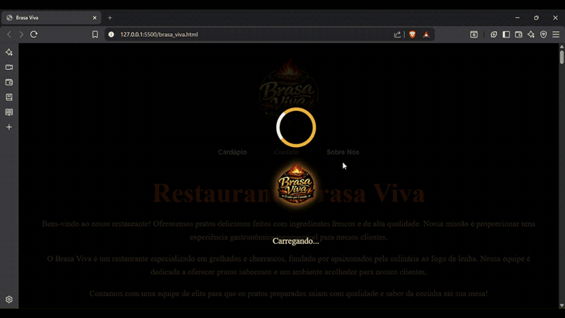

<p align="center">
  
</p>

<p align="center">
  <strong>Site institucional de restaurante especializado em grelhados</strong><br>
  <a href="https://brasa-viva.vercel.app">Ver no ar</a>
</p>

---

Landing page com design marcante, construída em torno do conceito de calor e
brasa — a identidade visual carrega a marca do começo ao fim.



## 🛠️ Tecnologias

- HTML5
- CSS3
- JavaScript

## 🎯 Sobre o projeto

O BrasaViva foi desenvolvido como um projeto de prática em front-end, com foco na criação de interfaces modernas, responsivas e visualmente impactantes.

O projeto prioriza design e experiência do usuário, utilizando JavaScript de forma pontual para melhorar a percepção de carregamento da página.

## ✨ Funcionalidades

- Layout moderno e visual impactante
- Design responsivo para diferentes dispositivos
- Estrutura organizada e semântica
- Tela de loading inicial

## ⚡ JavaScript aplicado

O JavaScript foi utilizado exclusivamente para implementar uma **tela de loading**, proporcionando uma melhor experiência ao usuário durante o carregamento da página.

## ▶️ Como executar o projeto

```bash
# Clone o repositório
git clone https://github.com/RyanZine/BrasaViva.git

# Acesse a pasta
cd BrasaViva

# Abra o arquivo index.html no navegador